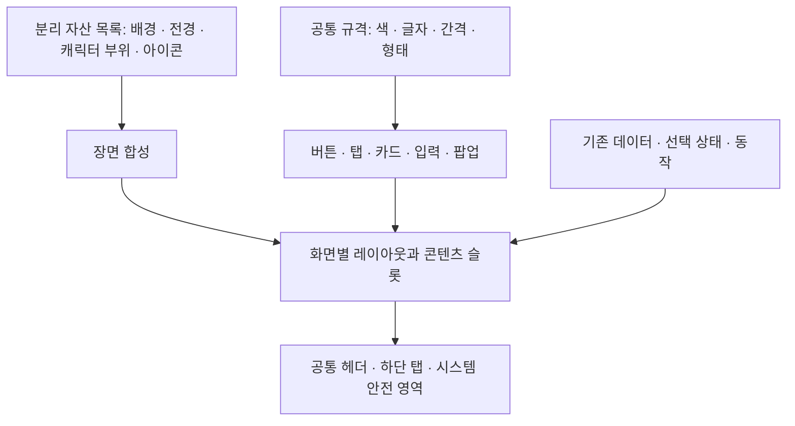

# StepUp 디자인·모듈·자산 제작 기획서

개정: 2026-09-24. 사용자 지시: 전체 화면을 대상으로, 배경·버튼 등 독립적으로 바꿀 수 있는 요소를 분리하고 재사용하는 디자인 체계를 먼저 설계한다.

**이 문서는 기획서와 화면별 적용 목록이다. 아래 신규 모듈 규격은 제안이며 아직 앱 전체에 구현하지 않았다.** 작성 후 화면 시안과 일부 독립 이미지 초안을 제작했다. 실제 진행 상태는 [화면 시안 현황](../../design/redesign-2026-09/screens/SCREEN-STATUS-KO.md)과 [원본 현황](../../design/redesign-2026-09/assets/modular/ASSET-STATUS-KO.md)을 따른다. 기존 화면별 일정만 제시한 계획은 이 문서로 대체한다.

후속 제작 현황(2026-09-24): 화면 디자인을 우선하고 제품 원본 제작을 보류했다. 기존 77개에 댓글·신고 3개, 게시판 연결 상태 2개, 지도 영역 상태 4개를 추가한 86개 작업표 항목에 기본 화면 시안 90장과 교정본 13장을 만들었고, 3A [공통 부품 보드](../../design/redesign-2026-09/screens/component-board.png)를 짙은 바탕·밝은 바탕·사진 배경으로 나눠 제작했다. 이는 앱 적용이나 전수 검증 완료 수치가 아니다. 독립 배경과 캐릭터·벤치 시험 원본은 [분리형 이미지 제작 현황](../../design/redesign-2026-09/assets/modular/ASSET-STATUS-KO.md)에 기록했다. 서기 포즈의 워터 신발 재시도도 접점이 맞지 않아 합성 통과 수는 아직 0개다.

## 1. 목표와 전체 범위

사용자 기준 전체 약 70장, 지금까지 작업을 제외해도 최소 50장 이상의 디자인을 다룬다. [전체 작업 목록](DESIGN-SCREEN-BACKLOG-KO.md)은 기존 촬영 코드에서 77개 화면·상태 검토 항목을 식별한 출발점이며 현재 댓글·신고 3개, 게시판 연결 상태 2개, 지도 영역 상태 4개를 더한 86개다. 서로 다른 페이지 수, 이미지 생성 수, 검증 완료 수를 섞지 않는다. 아직 목록에 없는 권한·오프라인·오류 등도 부모 화면의 작업 범위에 포함하고 실제 진입 경로가 확인되면 개별 항목으로 추가한다.

시각 방향은 승인된 강변 밤·노을, 검은 얼굴과 푸른 눈의 RUNO/LUMI, 원본 STEPUP 로고, 사용자가 지정한 큰 캐릭터와 3열 옷장이다. 그림은 풍부하게, 조작과 정보는 분명하게 유지한다. 일반 사용자가 자신의 캐릭터를 확인하고 꾸미거나 러닝을 시작하는 경험이 중심이다.

**설계 순서: 전체 목록 → 자산·공통 부품 규격 → 조합 시안 → 대표 화면 검증 → 화면군별 적용 → 전수 비교.** 다음 홈 작업 전에 공통 부품과 합성 규칙부터 맞춘다.

## 2. 이미 된 것과 새로 할 것

| 대상 | 현재 확인한 구현 | 앞으로 할 일 |
|---|---|---|
| 헤더·SUP·하단 탭·로고 | 공통 컴포넌트와 크기 규격 존재 | 기존 구현을 재사용하고 모든 화면의 사용 여부 확인 |
| 버튼·탭·글자 | 이미지와 분리된 실제 Compose UI, 공통 버튼 일부 존재 | 버튼 종류·상태·슬롯을 정리하고 화면별 변형을 공통 규격으로 옮김 |
| 배경·전신 캐릭터 | 각각 별도 이미지, 그림자·무대는 코드 표현 | 배경 메타정보, 화면별 호환 목록, 전경·가독성 막 분리 |
| 캐릭터 몸·의상·신발 | 현재 한 장의 전신 이미지. 착장별 전신을 교체 | 동일 포즈의 부위별 합성 자산을 작은 조합으로 먼저 검증 |
| 의상 목록 | 상품 이미지와 선택 테두리·체크·상태 문구가 분리 | 공통 상품 타일로 확장, 성별 착장과 상품 재단 차이 정리 |
| 카드·리스트·팝업·상태 | 일부 공통 구현, 화면 내부의 별도 구현도 존재 | 공통 부품·레이아웃에 매핑하고 실제 페이지마다 확인 |
| 전체 디자인 완료 | 옷장 1·2차의 일부 상태만 최신 검증 | 공통 부품 변경만으로 연결된 전체 페이지를 완료 처리하지 않음 |

현재 확인한 주요 파일: `StepUpDesign.kt`, `StepUpRoot.kt`, `AppChromePolicy.kt`, `Components.kt`, `RenewalParts.kt`, `RunnerScene.kt`, `CharacterStage.kt`, `SceneToolbar.kt`, `AvatarArt.kt`, `GarmentArt.kt`. 새 체계를 위해 기존 기반을 다시 복제하지 않는다.

## 3. 화면을 조합하는 구조

장면의 기본 앞뒤 순서는 **배경 → 무대/접지 → 뒤쪽 전경 → 캐릭터 → 앞쪽 전경 → 가독성 막 → UI → 팝업**이다. 벤치처럼 캐릭터를 가리는 물체는 앞·뒤 전경을 나눈다. 가독성 막은 헤더·텍스트 구역에만 적용하고 캐릭터 전체를 함께 어둡게 하지 않는다.

화면은 쓸 레이아웃, 콘텐츠, 현재 상태, 동작을 넘긴다. 로고 크기·버튼 모서리·하단바 높이를 화면마다 정하지 않는다. 공통 규격과 부품 수정이 연결 화면에 함께 반영되는 구조를 유지한다.

### 무엇을 어떤 형식으로 분리할지

| 요소 | 제작·보관 단위 | 앱 표시 방식 |
|---|---|---|
| 배경 | 장소·시간대별 원본과 배포용 이미지 | 독립 이미지, 화면별 크롭·호환 목록 |
| 벤치·난간 등 필요한 전경 | 앞/뒤 가림 관계가 필요한 물체별 투명 원본 | 캐릭터와 별도 레이어 |
| 캐릭터 | 성별·포즈별 기준 몸체와 교체 부위 | 호환 레이어 합성, 미지원 조합은 명시적 대체 규칙 |
| 상품 썸네일 | 의상·신발 상품별 이미지 | 상품 타일의 이미지 슬롯 |
| 로고·아이콘 | 원본 로고, 벡터 아이콘 단위 | 로고 역할별 크기, 공통 아이콘 규격 |
| 버튼·탭·카드 바탕 | 형태·색·테두리·그라데이션·그림자 규격 | 재사용 가능한 Compose 부품 |
| 글자·숫자·선택 표시 | 문자열·데이터·상태 | 실제 Text·Icon·선택 UI |
| 지도 | 실제 타일·경로·마커·정보 패널 | 좌표 기반 지도와 UI를 분리 |

독립적으로 바뀌는 단위에 맞춰 분리한다. 예를 들어 버튼은 하나의 재사용 부품 안에 바탕·아이콘·라벨·진행 표시 슬롯을 둔다. 동일한 버튼을 화면별 PNG로 생성하지 않는다. 특수 질감이 꼭 필요한 경우에만 공용 질감 이미지를 사용하고 글자·아이콘·터치 영역은 계속 분리한다.

## 4. 공통 디자인 부품 목록

다음 M01–M18은 **기획상 부품군 ID**다. 새 Kotlin 클래스 18개를 무조건 만든다는 의미가 아니다. 해당하는 기존 구현을 찾아 재사용·확장한다.

| ID | 부품군 | 공통 규격과 슬롯 | 기존 기반 / 필요한 보완 |
|---|---|---|---|
| M01 | 화면 공통 틀 | 메인/상세/집중/입력 헤더, 하단 탭, 안전 영역 | StepUpRoot·AppChromePolicy·MainHeader·SecondaryHeader 유지 |
| M02 | 브랜드·SUP | 원본 로고 역할, 실제 잔액/불러오는 중 표시 | Wordmark·SupPill 재사용 |
| M03 | 행동 버튼 | 주/보조/텍스트/위험 역할, 라벨·아이콘·처리 표시 | PrimaryCta·VoltButton·GhostButton 관계 정리, 스타일 중복 통합 |
| M04 | 아이콘 버튼 | 뒤로·닫기·더보기·배경 교체·지도 조작 | DarkIconButton·SceneToolbar 재사용, 아이콘과 터치 영역 분리 |
| M05 | 탭·선택칩 | 라벨·선택·개수·가로 넘침 | TwoWaySwitch·ChoiceChip 등 사용처 정리 |
| M06 | 공통 바탕 | 평면/강조/테두리 표면, 반경·여백·구분선 | GlowCard 등 역할 정리, 화면별 임의 발광 제거 |
| M07 | 상품 타일 | 그림·이름·등급·소유/체험·선택·가격 슬롯 | 옷장 ItemCell·SneakerCollectionCard 계열 공통화 |
| M08 | 목록 행 | 선행 아이콘/그림, 제목·설명, 우측 값/스위치/이동 | 설정·알림·기록·멤버 목록에 재사용 |
| M09 | 수치 표시 | 값·단위·설명·추이, 길어진 숫자 규칙 | StatCell·StatBar 재사용, 타이머/차트는 전용 하위 부품 |
| M10 | 진행·상태 배지 | 목표·진행·잠금·체험·등급·미확정 표시 | GoalBar·SmallBadge·FactionChip·RarityChip 정리 |
| M11 | 입력 | 라벨·입력값·도움말·오류·키보드·길이 제한 | 프로필·목표·글·크루·코스 작성의 공통 입력 규격 |
| M12 | 시트·대화상자 | 제목·본문·닫기·주/보조 행동·스크롤 영역 | FilterSheet 등 틀 재사용, 개별 내용 슬롯 |
| M13 | 짧은 피드백 | 처리 성공·실패·재시도·취소 | 표시 위치/길이/읽기 시간 통일, 중요한 정보는 화면에 유지 |
| M14 | 페이지 상태 | 준비·빈 상태·오류·미로그인·권한 없음 | 상태 그림/문구/주 행동 슬롯, 상태에 맞는 실제 동작 연결 |
| M15 | 장면 | 배경·접지·전경·가독성·교체 정책 | RunnerScene·TerraceStage 책임 정리, 중복 배경 합성 방지 |
| M16 | 캐릭터 | 성별·포즈·착장·합성 자산·고정 발 위치 | CharacterStage·AvatarArtCatalog 확장 후보, 소유 데이터 유지 |
| M17 | 지도 | 실제 타일·경로·마커·출처·조작·패널 | MapTiles·RouteMapLive·CourseMap 재사용 |
| M18 | 게시·모임 콘텐츠 | 작성자·본문·사진·시간·참여 정보·행동 | 커뮤니티·소식·모임의 반복 콘텐츠 단위 |

### 버튼과 조작 상태

| 대상 | 반드시 디자인할 상태 | 적용 기준 |
|---|---|---|
| 일반/아이콘 버튼 | 기본·눌림·포커스·비활성·처리 중 | 위치와 폭이 상태마다 튀지 않게, 처리 중 중복 탭 방지 |
| 탭·칩·상품 선택 | 미선택·선택·눌림·포커스·비활성 | 색상과 체크/형태로 선택을 함께 표시 |
| 입력 | 기본·포커스·입력됨·오류·비활성 | 라벨과 오류를 이미지에 넣지 않음 |
| 페이지/시트 | 준비·내용 있음·빈 상태·오류/재시도 | 실제로 가능한 상태만 설계, 숨겨진 행동도 접근 가능 |

성공·오류는 실제 작업 결과에 따라 피드백 영역에 표시한다. 선택 상태가 없는 일반 버튼에 억지로 선택 상태를 붙이지 않는다. 터치 외 입력을 지원하는 곳의 포커스/포인터 상태도 보드에 포함한다.

공통 시작값은 기존 규격을 유지한다: 좌우 20dp, 최소 터치 48dp, 주 버튼 최소 60dp, 주 버튼 글자 18sp, 일반 아이콘 24dp, 원본 헤더 로고 높이 26dp. 큰 글씨에서는 높이가 늘어날 수 있다. 자세한 값은 StepUpDesign/테마가 소유하며 화면에서 임의 덮어쓰지 않는다.

**첫 시각 제출물은 버튼·탭·카드·입력·팝업·상태를 모은 공통 부품 보드다.** 짙은 바탕, 밝은 바탕, 사진 배경 위에서 각각 보여 준다. 배경 변경에 따른 가독성은 부품과 별도 가독성 막이 책임진다.

## 5. 캐릭터 의상·신발을 분리하는 제작 설계

현재 전신 9개 자산은 남겨 두고 사용한다. 다음 자산 확장부터는 같은 몸체에 교체 가능한 부위를 합성하는 방식을 우선 검증한다.

### 원본 규칙

- 성별과 포즈별로 기준 캔버스·카메라·몸 비율·광원 방향을 고정한다. 현재 전신의 1024×1536 캔버스를 첫 검증의 기준으로 삼는다.
- 몸체/얼굴, 뒤·앞 머리카락, 모자, 의상, 신발을 독립 변경 단위로 설계한다. 상의·하의를 따로 선택하는 제품 규칙이 생기면 해당 슬롯을 나누며 현재 세트 의상 ID는 유지한다.
- 의상 앞에 나오는 손, 뒤로 가는 소매, 모자가 가리는 머리카락 등은 포즈별 앞/뒤 조각 또는 가림 마스크로 처리한다. 레이어 순서는 자산 명세가 소유한다.
- 잘린 조각은 원래 캔버스상의 위치를 보존한다. 화면에서 눈대중으로 x/y를 맞추지 않는다.
- 의상/신발의 원근·재질·접촉 그림자를 기준 몸체와 맞춘다. 기존 완성 이미지에서 조각을 잘랐다는 이유만으로 합성 가능한 원본으로 인정하지 않는다.
- 서기·달리기·앉기는 별도 포즈 묶음이다. 성별과 포즈가 다른 부위를 무조건 공유하지 않는다.
- 독립 교체가 필요한 빛/그림자는 별도 효과 또는 마스크로 관리한다. 전체 캐릭터 색조를 바꿔 상품 색을 왜곡하지 않는다.

### 먼저 할 최소 조합 검증

**LUMI / 서 있는 포즈 1개 / 의상 2종 / 신발 2종**으로 4개 조합을 만든다. 기준 몸체를 유지하며 의상만, 신발만 바뀌는지 확인한다. 같은 합성을 테라스·노을과 신규 배경 후보에 올려 본다.

판정 기준은 경계선·소매와 손의 겹침·모자와 머리카락·발 위치·원근·그림자·실제 착장 정보의 일치다. 통과한 규칙을 RUNO와 다른 포즈로 확장한다. 미지원 조합은 정확한 기존 전신이 있으면 사용하고, 없으면 실제 장착 정보와 미리보기의 차이를 표시한다. 다른 착장을 실제 착장처럼 표시하지 않는다.

독립 자산이 늘어도 조합마다 전신을 새로 생성하지 않도록 하는 것이 목적이다. 동시에 여러 투명 레이어를 매 프레임 합성하면 비용이 커질 수 있으므로, **원본은 분리 보관하고 실행 중에는 착장/포즈/크기/자산 버전이 바뀔 때만 합성 결과를 갱신하는 방식**을 검토한다. 캐시된 결과는 원본과 구분하며 새로운 판매/소유 아이템으로 취급하지 않는다.

최소 검증에서 필요한 원본·마스크·기존 재사용 파일을 먼저 표로 확정한다. 현재 신규 원본 수량은 미확정이다. 이전의 “3차 이미지 2장”은 배경만의 수량이며 이 캐릭터 분리 검증까지 포함한 전체 수량이 아니다. 분리 검증에 대한 추가 수량 없이 대량 생성으로 넘어가지 않는다.

## 6. 배경·전경의 독립 교체

- 배경 원본에는 UI·글자·캐릭터를 넣지 않는다. 가림이 필요한 벤치/전경은 별도 파일과 배치 정보를 둔다.
- 파일 목록만으로 호환성을 판단하지 않는다. 배경별로 바닥 구역, 지평선, 캐릭터 발 기준점, 크롭 안전 영역, 카메라 방향, 빛 방향·시간대, 허용 화면과 포즈를 기록한다.
- 좌표는 원본 기준 0–1 값과 캔버스 크기로 보관한다. 화면별 공통 레이아웃이 안전 영역을 적용한 뒤 변환한다. 장면 구역 안의 발 기준점과 화면 전체 높이를 혼동하지 않는다.
- 홈·옷장·러닝·앉은 프로필은 호환 목록을 분리한다. 실제 합성에서 물 위에 서 보였던 기존 야경은 옷장 목록에서 제외한 상태를 유지한다.
- 교체 기본안: 화면에 새로 진입할 때 호환 목록에서 현재 배경을 제외하고 선택한다. 목록이 하나면 유지한다. 재그리기·의상 변경·글자 크기 변경 때 다시 뽑지 않는다. 이전 화면으로 단순 복귀/상태 복원할 때는 선택을 보존한다.
- 러닝 진행 중에는 배경을 고정한다. 옷장의 직접 배경 버튼을 유지한다. 장면만 짧게 전환하며 캐릭터와 조작 위치는 고정한다. 움직임 줄이기에서는 단순 교체한다.
- 후보 이미지를 준비한 뒤 교체하고, 불러오지 못하면 기존 장면을 유지한다. 서버 공급·시간 주기 교체는 별도 후속 기능이다.

신규 배경 후보는 **지면이 보이는 푸른 야경 1장 + 새벽 강변 1장**, 총 2장이다. 기존 테라스·노을과 비교한 뒤 실제 맞는 화면의 목록에만 등록한다.

## 7. 파일 규격·등록·성능

새 폴더와 메타정보는 아래 책임으로 설계한다. 이번에 실제 폴더/로더를 만들었다는 의미는 아니다.

| 구분 | 보관/담당 | 최소 정보 |
|---|---|---|
| 편집 원본 | design 아래 원본 자산과 제작 기록 | 자산 ID·버전·참조·생성/편집 기록·캔버스·색 공간 |
| 앱 이미지 | res/drawable-nodpi 등 기존 자산 경로 | 배포 파일·치수·알파·용도·원본 ID |
| 아이콘 | 기존 아이콘/VectorDrawable, 필요 시 SVG 원본 | 이름·24 단위 기준 도형·선 굵기·사용 의미 |
| 합성 명세 | 배경/캐릭터 자산 등록 정보 | 성별·포즈·의상/신발 ID·레이어·위치·가림·호환 키 |
| UI 규격 | StepUpDesign·테마·공통 컴포넌트 | 의미별 색·글자·간격·모서리·그림자·상태 |
| 화면 명세 | 전체 작업 목록의 각 항목 | 레이아웃·모듈 ID·자산 ID·상태·검증 캡처 |

투명 원본은 PNG 등 알파를 보존하고, 앱 배포본은 품질 비교 후 적절한 WebP/PNG를 선택한다. 배경은 불필요한 알파를 제거한다. 썸네일은 전신 원본과 별도 크기를 사용한다. 기존 상품 ID·보유 정보·저장 식별자를 자산 이름 변경과 함께 바꾸지 않는다.

현재 리소스 생성기는 전신 PNG/WebP와 알파 기반 발 여백을 처리한다. 레이어 합성은 아직 지원하지 않으므로, 분리 방식이 검증되면 메타정보 검증과 로더를 필요한 범위만 확장한다. 원본을 등록했다고 모든 포즈/조합을 지원하는 것으로 간주하지 않는다.

성능 확인은 화면 품질과 함께 진행한다. 1024×1536 이미지를 4바이트 픽셀로 풀면 약 6MiB이므로 같은 크기 레이어 여섯 장은 픽셀 저장만 약 36MiB다. 압축 파일이 작아져도 이 비용이 자동으로 줄지는 않는다. 실제 표시 크기에 맞춘 디코딩, 알파 경계+원점 정보, 필요한 조합만 유지하는 제한된 캐시를 선택한다. 장면 후보와 모든 캐릭터 조합을 미리 전부 올리지 않는다. 버튼마다 큰 비트맵·전체 화면 흐림·상시 발광 애니메이션을 추가하지 않는다.

## 8. 전체 화면에 적용할 레이아웃

레이아웃은 배치 골격이다. 같은 골격 안에서 정보와 콘텐츠의 크기를 조절하며 모든 화면을 같은 카드 모양으로 만들지 않는다.

| ID | 골격 | 적용 예 |
|---|---|---|
| T01 | 장면 + 주요 행동/하단 슬롯 | 홈·러닝·옷장·프로필·챌린지 |
| T02 | 탭/필터 + 상품 목록 | 보관함·마켓·도감 |
| T03 | 큰 대상 + 상세 정보 + 행동 | 신발·마켓 모델·모임 상세 |
| T04 | 제목/탭 + 콘텐츠 목록 | 설정·알림·소식·게시판·커뮤니티 |
| T05 | 입력 + 고정 제출 행동 | 글·크루·코스 생성 |
| T06 | 요약 + 수치/기록 목록 | 지갑·업적·통계·랭킹 |
| T07 | 실제 지도 + 조작 + 정보 패널 | 지도·코스·기록 지도 |
| T08 | 대화상자/하단 시트/안내 오버레이 | 필터·편집·확인·첫 사용 안내 |
| T09 | 브랜드/시작·인증 | 로딩·로고 전환·로그인 |

기존 77개 검토 항목과 추가한 댓글·신고·게시판 연결·지도 영역 상태 9개에 골격과 필수 부품군을 매핑했다. 이 매핑은 **적용 설계안**이며 현재 그 모듈을 모두 사용한다는 보고가 아니다. 항목별 신규 이미지 필요 여부도 함께 기록한다. 그려야 할 원본 수는 이 항목 수와 다르다.

### 지도 제약

현재 MapTiles/RouteMapLive의 2D 래스터 지도, 확대 3–18, 256px 타일, 화면당 최대 24장 규칙을 기준으로 한다. 실제 타일 위에 경로·현재 위치·시작/도착·선택 표시를 그리고 조작·출처·정보창은 별도 UI로 둔다. 생성형 도시 그림을 실제 경로처럼 쓰지 않는다. 타일 안의 지명·도로 글자를 개별 UI처럼 수정할 수 있다는 전제로 시안을 만들지 않는다. 정보창과 조작이 출처/경로를 가리지 않아야 하며 지도 화면의 배경에 랜덤 풍경을 적용하지 않는다.

## 9. 수정한 작업 순서와 제출물

| 차수 | 작업 | 끝날 때 제출할 것 |
|---|---|---|
| **3A: 구조와 부품** | 전체 항목 매핑 보완, 공통 부품 상태/규격, 레이어 규격·원본 목록 확정 | 공통 부품 보드, 분해 조합도, 화면별 모듈표, 정확한 다음 생성 수량 |
| **3B: 최소 조합 검증** | LUMI 서기 2의상×2신발, 배경 교체 검증, 기존 옷장/홈/필터 시트로 부품 적용 | 4개 착장 합성, 배경 비교, 대표 3개 구성의 실제 캡처·차이 목록 |
| **3C: 홈·시작 마감** | 홈·더보기, 로딩·로고·실패 안내, 검증된 배경 적용 | 시안/앱 비교와 실제 전환 영상, 같은 버전 APK |
| 4차 | 러닝 각 상태, 코스·생성·게시판, 지도/영역 탭과 관련 확인창 | 러닝·코스·지도 묶음의 개별 결과 |
| 5차 | 내 정보·편집·목표, 챌린지 각 상태, 소식 탭, 앉기/벤치 자산 | 프로필·챌린지·소식 묶음 |
| 6차 | 옷장 남은 범위, 보관함·상점·거래·내 거래·필터, 러너 마켓, 신발 상세·도감·확인창 | 꾸미기/마켓 전체 묶음 |
| 7차 | 커뮤니티 탭·크루·번개·참여자·대기실·게시판·댓글·신고·글 작성·랭킹 | 커뮤니티와 모임 전체 묶음 |
| 8차 | 기록 지도·기간, 통계·날짜/주 상세, 업적, 지갑 | 기록·통계·업적·지갑 묶음 |
| 9차 | 로그인·첫 사용 안내, 설정 7종·설정 목록, 알림, 누락된 상태 화면 | 계정·설정·알림·상태 묶음 |
| 10차 | 앞선 전체 화면의 일관성과 작은 화면·큰 글씨·테마 비교 | 전수 보드·완료/잔여 목록·동일 버전 APK |

3A의 부품 보드와 분해 조합도를 먼저 보여 준다. 파일 구조만 정리한 결과를 디자인 진척으로 대신하지 않는다. 3B의 캐릭터 합성에서 해결이 필요한 부분은 정확히 기록하고, 가능한 UI 부품/배경 작업은 계속 진행한다. 결과에 따라 필요한 원본을 보완하며 검증 전 모든 성별·포즈·장비 조합으로 생성 범위를 늘리지 않는다.

각 차수는 **필요 자산 목록 → 시안 → 실제 적용 → 묶음 검토 → 차이 일괄 수정 → 확인본** 순서다. 최종 차수에 남은 50장 이상의 첫 디자인을 몰아넣지 않는다.

## 10. 완료 기준과 변경 경계

완료 판정은 세 단위로 따로 한다.

| 단위 | 완료 근거 |
|---|---|
| 자산 | 원본·알파·규격·호환 정보, 실제 합성 검토 |
| 부품 | 필요한 상태 보드, 접근성·크기·테마·실제 조작 확인 |
| 화면/상태 | 기준 시안 + 공통 부품 적용 + 같은 버전 실제 캡처 + 남은 차이 기록 |

한 화면의 검사 통과를 현재 전체 86개 완료로 확장하지 않는다. 각 화면은 해당하는 기본/빈/오류/미로그인/권한 상태와 작은 화면·큰 글씨를 확인한다. 실제로 해당하지 않는 상태는 이유를 남긴다. 검토는 차수별로 묶어서 한 번, 수정 후 확인 한 번을 기본으로 한다. 새 결함이 없는 반복 생성·촬영은 하지 않는다.

장식 이미지에서 버튼·글자가 분리되는지, 단일 부품 변경이 관련 화면에 적용되는지, 배경 교체 때 착장·UI가 유지되는지, 긴 한국어/다른 언어와 숫자가 들어오는지를 실제 결과로 확인한다. 데모 상태는 데모로 표시한다.

디자인 구현에 필요한 UI 합성·스타일·자산 등록은 범위에 포함한다. 계정·소유권·보상·저장 구조·서버·지갑 연동 재설계는 포함하지 않는다. 분리 제작의 효율은 원본 재사용, 수정 영향 범위, 앱 용량/메모리와 화면 품질을 함께 보고 판단한다.

관련 근거: [전체 화면별 모듈 적용표](DESIGN-SCREEN-BACKLOG-KO.md), [2차 실제 결과](wardrobe-stage2-review.html), [2차 자산 기록](STAGE-2-ASSET-GUIDE-KO.md), [기존 배경·지도 제약](DESIGN-FOUNDATION-KO.md), [검증 기록](PROGRESS.md).
