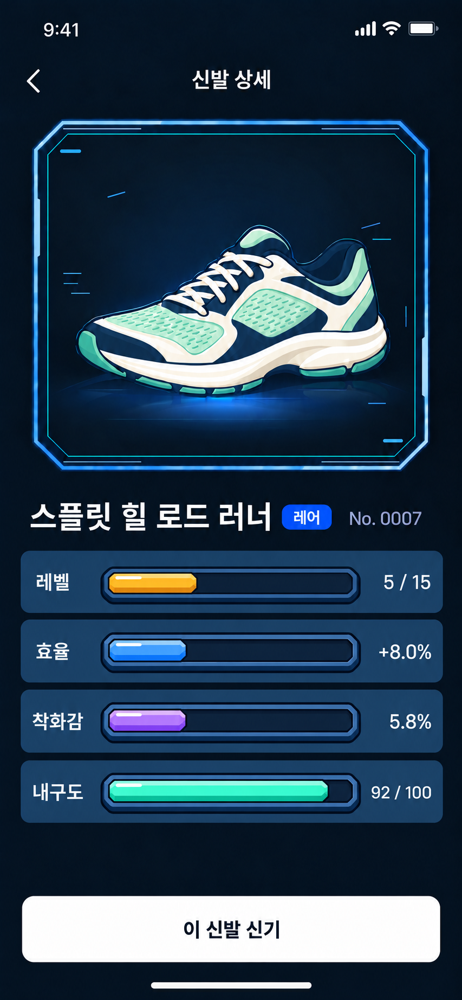

# StepUp 신발 상세 카툰 입체 바 구현 지시서

사용자가 확정한 `approved.png`의 1번 카툰 입체형을 실제 신발 상세 화면에 구현한다. 스틸 블루 배경의 독립된 네 칸 안에 항목명, 카툰 입체 바, 실제 수치를 한 줄로 표시한다. 신발 이름 다음에는 등급 배지와 넘버를 같은 줄에 둔다.

이 문서와 첨부 이미지는 이번 변경의 기준이다. 다른 시안을 섞거나 추가 시안을 만들지 않는다. 앱의 기존 기능과 데이터 흐름을 유지하면서 신발 상세 본문을 수정한다.

## 확정 화면

위에서 아래 순서는 다음과 같다.

1. 뒤로 가기와 신발 상세 제목.
2. 기존 등급별 배경과 프레임 안의 실제 신발.
3. 신발 이름 → 등급 배지 → No. 신발 번호.
4. 레벨, 효율, 착화감, 내구도 순서의 독립된 네 칸.
5. 하단의 이 신발 신기 버튼.

각 능력치 칸은 반드시 다음과 같은 한 줄이다.

`레벨  [카툰 입체 바]  5 / 15`

항목명이나 수치를 바 위아래로 옮기지 않는다. 네 칸 전체를 감싸는 추가 배경을 만들지 않는다. 네 칸 사이에는 화면의 어두운 배경이 보이도록 간격을 둔다.

시안의 신발명, 레어 등급, No. 0007, 5 / 15, +8.0%, 5.8%, 92 / 100은 예시다. 실제 앱에서는 선택한 보유 신발의 데이터를 표시한다.

## 수정 범위

대상은 신발 상세 화면과 그 안에서 사용하는 바 컴포넌트다. 신발 탭의 내 신발 화면, 보관함, 러닝 홈의 디자인까지 일괄 변경하지 않는다.

현재 상세 본문의 주요 수치와 능력치 자세히, 신발 정보 링크를 이 네 줄로 통합한다. 본문에는 속성, 행운, 착화감 원시 배율, 별도 에너지 행을 추가하지 않는다. 기존 데이터 필드와 다른 화면에서 쓰는 기능을 삭제하는 작업은 아니다.

삭제할 화면 문구는 다음과 같다.

- 효율은 SUP 보너스 · 착화감은 에너지 절약
- 그 외 바 아래에 붙이는 능력치 설명, 범례, 도움말 문장
- 같은 수치를 중복 표시하는 요약 영역

기존 상단 관리 메뉴의 강화, 수리, 판매 진입은 유지한다. 확정 시안에 관리 메뉴가 생략되어 있어도 실제 앱 기능을 없애지 않는다. 본문에 관리 버튼을 추가로 늘어놓지 않는다. 조회, 착용, 강화, 수리, 판매의 서버 로직과 네비게이션은 유지한다.

## 배치와 크기

아래 치수는 390dp 너비에서 시작할 구현 기준이다. 생성 이미지의 픽셀을 고정 좌표로 옮기지 말고 실제 기기에서 맞춘다.

| 요소 | 시작값 |
|---|---|
| 본문 좌우 여백 | 16dp |
| 각 능력치 칸 | 전체 너비, 기본 높이 54dp, 모서리 14dp |
| 칸 사이 간격 | 8dp |
| 칸 안 좌우 여백 | 12dp |
| 항목명 | 17sp SemiBold, 기본 열 너비 52dp |
| 오른쪽 값 | 16sp Medium, 기본 열 너비 64dp, 오른쪽 정렬 |
| 열 사이 간격 | 8dp |
| 바 영역 | 가운데 남는 너비, 네 행 모두 동일한 시작점과 끝점 |
| 바 전체 높이 | 약 30dp, 외곽 프레임 포함 |
| 색상 채움 높이 | 약 18~20dp |
| 하단 버튼 | 기존 공통 버튼 기반, 기본 높이 56dp, 흰색 배경 |

각 행의 항목명, 바, 값은 수직 중앙을 맞춘다. 내구도 값이 길다고 그 행의 바만 짧아지면 안 된다. 숫자는 가능하면 고정폭 숫자 글리프를 쓴다.

신발 이름, 등급 배지, 넘버는 평상시 한 줄에 배치한다. 넘버는 반드시 배지 바로 오른쪽에 붙인다. 긴 이름이나 큰 글씨에서는 이름을 최대 두 줄로 처리할 수 있으나 배지와 넘버는 함께 유지한다. 넘버만 별도 줄로 떨어뜨리지 않는다. 글씨를 과하게 줄여 한 줄에 억지로 맞추지 않는다.

기존 등급 배지는 채운 색과 흰 글자의 공통 컴포넌트를 재사용한다. 바의 카툰 테두리를 등급 배지에 추가하지 않는다.

작은 화면에서는 먼저 신발 무대 높이와 여백을 조절한다. 그래도 부족하면 본문이 스크롤되게 한다. 글자 확대 시 행 높이는 늘어날 수 있다. 버튼과 시스템 내비게이션이 내용을 가리지 않게 한다.

## 카툰 입체 바의 모양

일반 ProgressIndicator에 색만 바꾸는 것으로 끝내지 않는다. 확정 시안처럼 바 자체에 뚜렷한 외곽선과 입체적인 면이 있어야 한다.

전체 바는 다음 순서로 그린다.

1. 아래로 약 2~3dp 내려온 어두운 받침 면.
2. 짙은 잉크색 외곽선. 두께 약 1.5~2dp.
3. 파란 회색의 프레임 면. 위쪽 면은 밝고 아래쪽 면은 어둡게.
4. 안으로 들어간 짙은 남색 트랙.
5. 실제 진행률만큼 길어지는 색상 채움.
6. 채움의 밝은 윗면, 선명한 정면, 어두운 아랫면.
7. 채움 왼쪽 위의 짧고 둥근 하이라이트 한 줄.

외곽은 모서리를 짧게 잘라낸 둥근 사각형이다. 완전히 둥근 기본 알약 바와 구분되도록 면과 테두리를 그린다. 프레임은 두 겹의 선과 색 면으로 표현하되 작은 크기에서도 복잡하게 보이지 않게 한다.

채움은 끊기지 않는 하나의 입체 막대다. 분할 블록, 눈금, 사선 줄무늬, SF 금속 장식을 섞지 않는다. 채움 끝에도 짧은 모서리 면과 어두운 외곽선을 적용한다.

명암은 선명하게 나뉜 2~3개의 색 면으로 표현한다. 강한 블러, 화면 밖으로 번지는 네온, 유리 질감, 입자, 반짝이, 아이콘, 슬라이더 손잡이는 넣지 않는다. 네 줄의 프레임은 같은 디자인이며 채움 계열 색만 다르다.

색상 칸의 배경은 계속 평평한 스틸 블루다. 입체 효과는 중앙의 바에 집중한다.

## 색상

아래 값은 구현 시작용 토큰이다. 실제 화면 캡처에서 확정 이미지와 비교해 미세 조정한다.

| 공통 요소 | 색상 |
|---|---|
| 화면 배경 | #06111E |
| 네 칸의 스틸 블루 배경 | #244768 |
| 글자 | #F4F7FC |
| 넘버 | #A5B5CF |
| 바의 짙은 외곽선 | #04101E |
| 바의 파란 프레임 | #2D6699 |
| 프레임 윗면 | #5B9ACD |
| 프레임 아랫면 | #143B62 |
| 비어 있는 안쪽 트랙 | #081D32 |

| 항목 | 정면 | 윗면 | 아랫면 |
|---|---|---|---|
| 레벨 | #FFBD35 | #FFE586 | #C77A0E |
| 효율 | #2E99FF | #80CBFF | #1254B0 |
| 착화감 | #A779F3 | #D0B5FF | #6630AF |
| 내구도 | #27DCC5 | #93FFEC | #0B927C |

색의 의미는 신발 등급에 따라 바꾸지 않는다. 에픽 신발을 보더라도 효율은 파랑, 착화감은 보라다. 이번 바의 명암 색은 확정된 카툰 시안을 따른다.

## 실제 값과 막대 길이

기존 계산 함수를 재사용한다. 이미지에 적힌 예시 값을 실제 계정 데이터로 하드코딩하지 않는다.

| 행 | 실제 표시값 | 진행률 계산 |
|---|---|---|
| 레벨 | shoe.level / shoe.maxLevel | level ÷ maxLevel |
| 효율 | formatBonus(bonusPercent(shoe)) | bonusPercent ÷ StatScale.EFFICIENCY_MAX_PERCENT |
| 착화감 | formatPercent(energySavingPercent(shoe)) | energySavingPercent ÷ StatScale.ENERGY_MAX_PERCENT |
| 내구도 | formatDurability(shoe) | durabilityPoints ÷ StatScale.DURABILITY_MAX |

현재 확인된 기준은 효율 27.5%, 착화감 20%, 내구도 100이다. 레벨 상한은 `shoe.maxLevel`을 사용한다. 서버의 양수 상한이 우선이며 기존 등급별 기본값은 일반 10, 레어 15, 에픽 20, 레전더리 30이다.

서버 효율은 `efficiencyBps / 100.0`, 착화감은 기존 `energySavingPercent`로 표시한다. 서버 착화감은 에너지 절감 비율이므로 원시 착화감 1.xx와 에너지 절감 행으로 나누지 않는다. 서버 내구도는 기존 함수대로 소수점을 내림한다. 예를 들어 99.6은 99 / 100이다.

진행률은 0~1로 제한한다. 분모가 0 이하이거나 계산값이 유효하지 않으면 계산 오류를 막는다. 단, 아직 데이터를 읽지 못한 상태를 실제 0으로 표시하지 않는다.

시안 예시의 올바른 길이는 다음과 같다.

- 레벨 5 / 15 → 33.3%
- 효율 +8.0% → 8.0 / 27.5 → 약 29.1%
- 착화감 5.8% → 5.8 / 20 → 29.0%
- 내구도 92 / 100 → 92%

진행률은 장식 프레임을 제외한 안쪽 트랙 전체 너비에 적용한다. 프레임을 포함한 폭으로 채움을 계산하지 않는다.

0이면 색상 채움과 하이라이트를 그리지 않는다. 아주 작은 양수일 때 큰 최소 길이를 강제로 주지 않는다. 채움 모서리의 사선 깊이는 채움 길이의 절반 이하로 줄여서 작은 값에서도 모양이 뒤집히지 않게 한다. 100%에서는 안쪽 트랙을 끝까지 채우되 외곽 프레임을 침범하지 않는다.

신발 번호는 해당 보유 신발의 `mintNumber`다. 네 자리보다 짧으면 앞을 0으로 채우되 더 긴 번호는 자르지 않는다. 도감 `modelId`, 목록 인덱스, NFT `tokenId`를 대신 쓰지 않는다. 신발 선택과 착용 요청은 실제 소유 `id`로 한다.

## 신발 이미지와 등급 배경

현재 앱의 실제 신발 이미지와 `SneakerGradeStage`를 재사용한다. 생성된 화면에서 신발을 잘라내 새 원본으로 사용하지 않는다.

기존 레이어 순서와 비율을 유지한다.

`무대 면 → 뒤 효과 → 신발 → 앞 효과 → 프레임`

무대 아트 비율은 440:418이다. 선택한 신발의 `ShoeTier`에 맞는 배경과 프레임을 사용하며, 다른 등급에서도 시안의 파란 프레임을 고정하지 않는다. 레드라인과 피니시는 현재의 시리즈 처리를 유지한다.

## 구현 방식과 상태

Android Jetpack Compose의 실제 화면을 수정한다. 전체 스크린샷을 배경으로 쓰거나 HTML 화면으로 대체하지 않는다. 글자, 값, 등급 배지와 버튼은 네이티브 요소로 남겨야 한다.

바는 Canvas 또는 기존 프로젝트에 맞는 경로 그리기로 구현한다. 고정 크기 비트맵으로 채움 길이를 늘리면 테두리가 찌그러지므로 사용하지 않는다. `fraction`, 채움 색 묶음, 크기를 받는 재사용 컴포넌트로 만들고 네 행에서 같은 컴포넌트를 사용한다. 이 컴포넌트의 적용 범위는 우선 신발 상세로 제한한다.

반복 반짝임이나 자동 펄스 애니메이션은 추가하지 않는다. 기존에 데이터 변경 전환이 있다면 과장하지 않고 유지한다. 카툰 스타일은 정적인 모양과 명암으로 완성한다.

기존 조회 중, 조회 실패, 없는 신발, 이미지 실패와 재시도 상태를 유지한다. 실패를 빈 보유 목록이나 예시 신발로 대체하지 않는다.

하단 착용 버튼은 기존 상태를 따른다.

| 상태 | 표시와 동작 |
|---|---|
| 보유했지만 미착용 | 이 신발 신기, 활성 |
| 이미 착용 중 | 지금 신고 있어요, 비활성 |
| 변경 요청 중 | 신발 바꾸는 중…, 중복 요청 차단 |
| 조회 중 | 확인 중…, 비활성 |
| 변경 실패 또는 미확인 | 기존 오류 안내와 재시도 유지 |

서버 응답과 실제 저장된 착용 상태가 확인된 뒤 성공을 알린다. 눌렀다는 이유만으로 성공 표시를 만들지 않는다.

읽기 도구에는 행 이름과 실제 값을 함께 제공한다. 장식 경로는 별도 읽기 항목이 아니다. 시각적인 설명 문구는 제거하되, 접근성 설명에는 의미와 상한을 제공할 수 있다. 바는 입력용 슬라이더가 아니다.

## 현재 코드에서 확인할 위치

다음은 이번 지시서를 작성하며 확인한 상대 경로다. 전달받은 작업 폴더에서 최신 파일과 문서를 먼저 확인한다.

| 목적 | 경로 |
|---|---|
| 상세 화면과 착용 상태 UI | app/src/main/java/com/stepup/android/ui/screens/items/SneakerDetailScreen.kt |
| 수치와 착용 결과 계산 | app/src/main/java/com/stepup/android/ui/screens/items/ShoeDetailModel.kt |
| 바 기준과 기존 계산 | app/src/main/java/com/stepup/android/ui/screens/customize/MyShoesModel.kt |
| 실제 신발 데이터와 상한 | app/src/main/java/com/stepup/android/domain/Sneaker.kt |
| 신발과 등급 무대 | app/src/main/java/com/stepup/android/ui/components/SneakerImage.kt |
| 공통 등급 배지 | app/src/main/java/com/stepup/android/ui/components/ShoeGradeBadge.kt |
| 현재 신발 화면 설명 | docs/redesign/shoes-ui-2026-09-28/README.md |
| 최신 공통 배지와 수치 색상 | docs/redesign/run-journey-2026-09-29/README.md |
| 전체 진행 상황 | docs/redesign/s2/README.md 및 STATUS.md |

확인한 작업 폴더는 `C:/Users/gana0/OneDrive/문서/New project 3/stepup-waitlist-implementation`이다. 다른 위치의 오래된 복사본을 최신 기준으로 오인하지 않는다. 현재 사용자 지시가 과거 화면 배치나 색상 지침보다 우선한다.

기존 상세의 `DetailBody`를 중심으로 변경하되 `ShoeDetailContent`의 상태 처리와 관리 메뉴를 보존한다. 현재 본문이 쓰는 능력치 시트용 `shoeStats`를 그대로 펼쳐 행운과 원시 착화감을 재노출하지 않는다. 이번 화면은 레벨 1줄과 `statBars`가 표현하는 실제 능력치 3줄이다.

## 완료 확인과 전달

확정 이미지와 같은 신발 및 예시 값은 미리보기나 기기 캡처용 고정 데이터에서만 사용한다. 실제 앱의 계정과 소유 데이터는 변경하지 않는다.

- 390×844에서 확정 이미지와 나란히 비교한다. 바 외곽선, 윗면, 아랫면, 하이라이트가 모두 구분되어야 한다.
- 360dp 너비와 큰 글씨에서 이름, 배지, 넘버, 바, 수치가 서로 겹치지 않는지 확인한다.
- 네 개의 스틸 블루 칸이 분리되어 있고 바 시작점과 끝점이 동일한지 확인한다.
- 0%, 작은 양수, 중간값, 100%에서 채움 길이와 모서리를 확인한다. 긴 숫자와 등급별 레벨 상한도 확인한다.
- 속성, 행운, 원시 배율, 중복 에너지 행, 설명 문장이 본문에 없는지 확인한다.
- 미착용, 착용 중, 요청 중, 실패 상태의 기존 동작을 확인한다.
- 프로젝트 AGENTS.md의 디자인 계약 검사와 문자열·리소스 검사, 변경 관련 기존 테스트를 실행한다. ShoeDetailModelTest, MyShoesModelTest, ShoeDetailDesignTest 중 변경 영향이 있는 검사를 사용한다.
- 실제 앱 빌드와 동일한 변경 상태에서 화면을 캡처한다. 생성 시안을 앱 구현 완료 증거로 제출하지 않는다.

완료 보고에는 변경 파일, 실제 화면 캡처, 실행한 검사 결과, 확인하지 못한 항목만 간결하게 적는다. 구현 요청이더라도 배포나 외부 게시까지 자동으로 확장하지 않는다.

