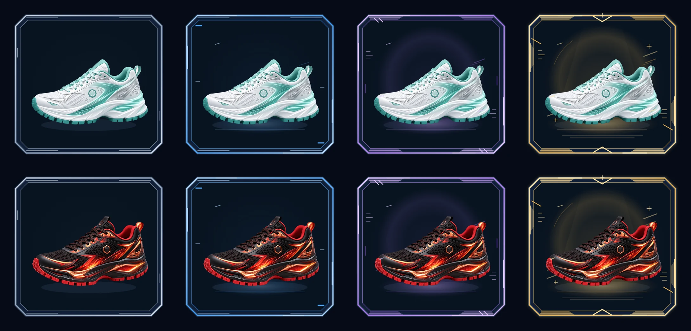
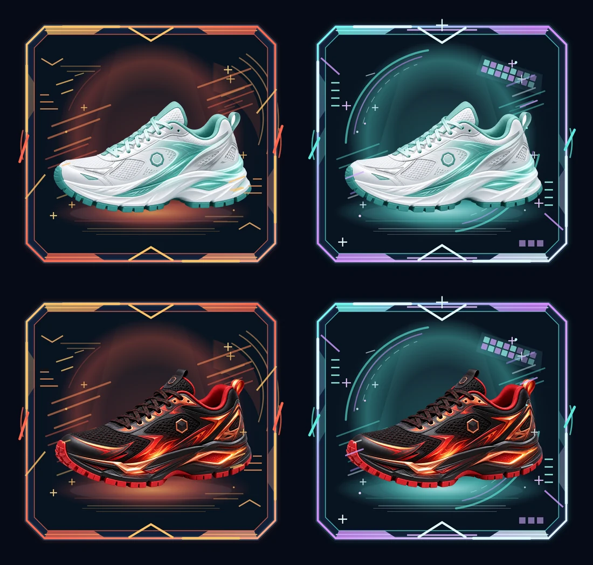
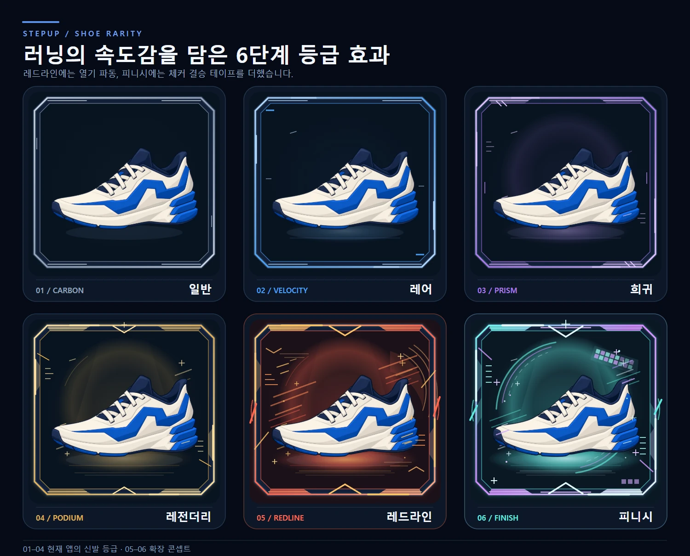
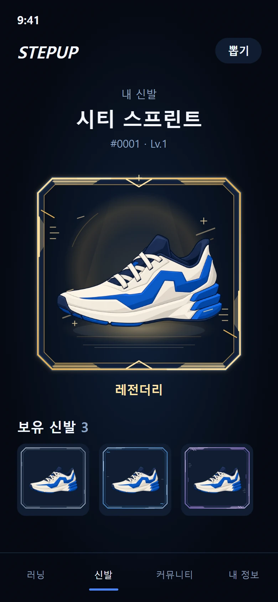
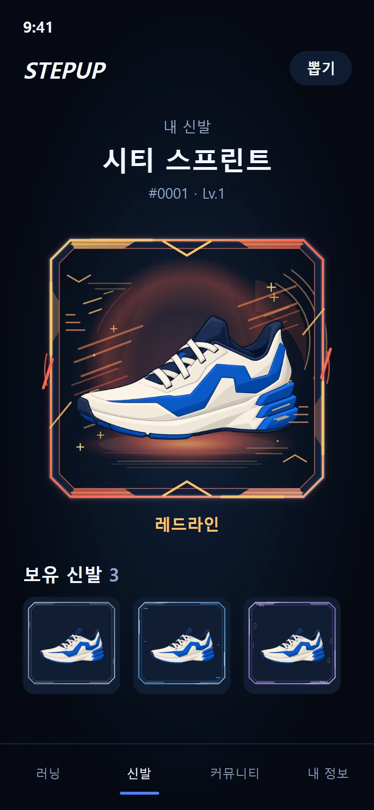
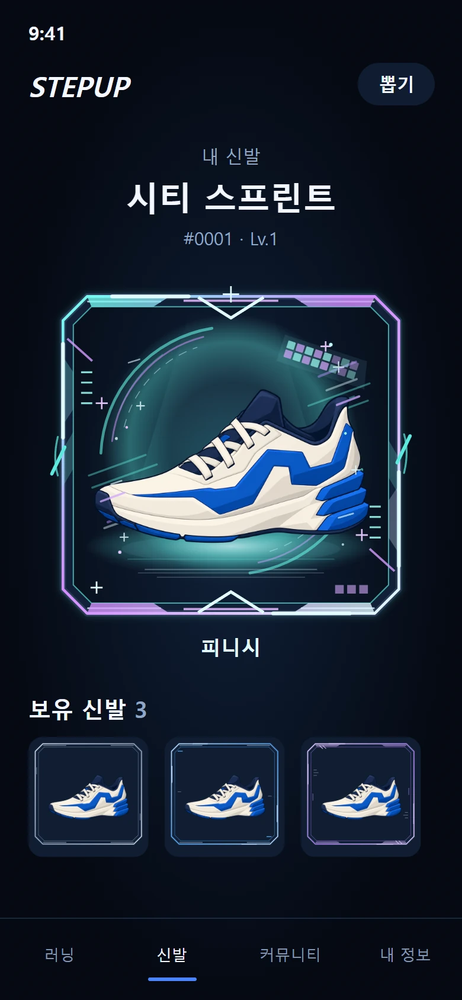

# 신발 등급 프레임 v8 (2026-09-27)

사용자 전달본 "StepUp 신발 등급 프레임 v8"(`design/shoe-grade-frames-v8/` — `CLAUDE_HANDOFF.md`, 비교판 · 모바일 시안,
투명 레이어 18장)을 실제 앱에 적용했다. 앱에는 **현재 등급 넷(일반 · 레어 · 에픽 · 레전더리)** 만 연결했다.
레드라인 · 피니시(05 · 06)는 확장 콘셉트라 도메인 · NFT · 드롭률 · 보상 · 앱 그림 어디에도 넣지 않고 아래 미리 보기로만 둔다.

## 등급과 레이어

| 시안 | 앱 등급 | 뒤 효과 | 앞 효과 | 프레임 |
|---|---|---|---|---|
| 01 CARBON `#91A1B8` | 일반 COMMON | 바닥 그림자 | 없음(시안이 비어 있음) | 카본 테두리 |
| 02 VELOCITY `#4A9FF0` | 레어 RARE | + 푸른 바닥광 · 짧은 선 | 작은 반사광 | + 눈금 |
| 03 PRISM `#A778E6` | 에픽 EPIC | + 후광 · 속도선 | + 앞코 · 뒤꿈치 반사광 | + 금속판 · 빗금 |
| 04 PODIUM `#E2AE52` | 레전더리 LEGENDARY | + 스포트라이트 · 궤적 | + 광점(+) | + 금속판 · 꺾쇠 · 바깥 빛 |

- 겹치는 순서: **무대 면 → 뒤 효과 → 실제 신발 → 앞 효과 → 프레임 → Compose 글자 · 버튼**(시안 그대로).
- 레이어는 시안의 좌표(440 × 418) 그대로 `tools/build_shoe_grade_frames.py` 가 Chromium 으로 투명 WebP 를 만든다 —
  `res/drawable-nodpi/shoe_grade_{common,rare,epic,legendary}_{back,front,frame,frame_small}.webp`(15장, 690KB).
  큰 무대는 2배(880 × 836), 목록 칸은 1배 프레임. 전달받은 PNG(1배)와 알파가 같다(프레임 · 앞 효과 평균 차 0.1 미만).
- 뒤 효과에는 비교판 카드가 back-effect 앞에 까는 등급색 오라(최대 9%)를 함께 구웠다 — 비교판과 같은 결과가 나오게.
- 무대 면은 비교판 카드 안쪽 색 `#081320`(목록 칸은 모바일 시안의 `#101E32`)을 프레임 바깥 팔각형 모양으로 깐다.
  효과가 어두운 면을 전제로 그려져 있어 **밝은 테마에서도 이 면을 깐다**(밝은 화면 위의 어두운 진열대).
- 등급색으로 신발을 물들이지 않는다 — 속성색(불 · 물 · 번개 · 바람)은 신발 그림 그대로. `Rarity.tint()`(글자 · 칩 색)도 그대로.

## 실제 신발 자리

신발 52장은 모두 같은 판(640 × 640)에 시트의 자리 그대로 들어 있다. 한 켤레에 맞추지 않고 **판 전체를 한 자리**에 둔다
(52장의 테두리를 모두 재서 정함 — 가로는 시안 신발과 같은 320, 가운데 바닥 선이 바닥광 위).

- 큰 무대: 판을 (61, 58)에 한 변 320. 52장 모두 앞코 · 끈 · 뒤꿈치가 프레임 안쪽(37–403 × 37–381)에 들어온다.
- 목록 칸: 모바일 시안의 보유 신발처럼 조금 작게 — (69, 69)에 한 변 296, 프레임만(효과 없음).
- 앞 효과 중 앞코 · 뒤꿈치 가장자리에 걸리는 짧은 반사광 두 줄(03 · 04)은 시안의 목업 신발에도 같은 만큼 걸린다
  (126px · 67px @2배, 실제 신발 최대 126px · 92px) — 가리는 효과가 아니라 시안이 의도한 반사광이다.

## 앱에서 쓰는 곳

| 곳 | 무엇 | 파일 |
|---|---|---|
| 신발 탭 첫 화면(내 신발) | 큰 무대 — 착용 중 · 고른 신발 | `CustomizeScreen.kt` · `S2ShoeStage` → `SneakerGradeStage` |
| 신발 탭 보유 신발 칸 | 목록 칸(프레임만) | `CustomizeScreen.kt` `ShoeChoice` → `SneakerGradeThumb` |
| 보관함 착용 카드 · 컬렉션 칸 | 큰 무대 · 목록 칸 | `SneakerCards.kt` `EquippedSneakerCard` · `SneakerCollectionCard` |
| 신발 상세 · 마켓 모델 | 큰 무대(상세는 기존처럼 신발이 살짝 뜬다) | `SneakerDetailScreen.kt` · `MarketModelScreen.kt`(`S2ShoeStage`) |
| 뽑기 결과 | 큰 무대(한 변 240dp까지) — 나타나기 · 반짝임은 그대로 | `MysteryBoxScreen.kt` `DrawResultDialog` |

- 비율은 늘 440:418 — 폭(또는 남은 높이)만 주고 높이는 비율이 정한다. 예전 4:3 · 1.4 칸 그림 자리는 440:418 로 바뀌어
  칸이 조금 높아졌다(찌그러뜨리지 않는다).
- 신발 탭 큰 무대는 예전 파란 면(312:214)보다 높다. 이름 · 무대가 목록 창 안에 들도록 **남은 높이만큼만** 키운다 —
  짧은 화면에서는 무대가 줄어 첫 화면에 잘리지 않고, "신발 상세 보기"는 창 아래로 조금 내려갈 수 있다.
  창이 아주 짧으면(가로 화면 · 큰 글씨) 무대를 한 변 190dp 아래로 줄이지 않고 스크롤에 맡긴다.
- 적용하지 않은 곳: 도감 칸(없는 신발은 회색 실루엣), 마켓 목록 · 홈 · 강화 확인의 작은 그림(72dp 이하 — 프레임이 신발을 가린다).
- 이름 · 레벨 · 착용 상태 · 누르기 · 고르기 · 신기 동작은 그대로다. 문구 · 숫자 · 버튼은 Compose 가 그린다.

## 05 · 06 확장 콘셉트 — 미리 보기만

앱에 넣지 않았다(도메인 `Rarity` 는 넷 그대로, 서버 드롭률 · 보상 · NFT 등급도 그대로). 등급을 늘리는 것은 사용자가 따로 정할 제품 결정이다.
원본 레이어는 `design/shoe-grade-frames-v8/*-05.svg` · `*-06.svg`. 아래는 실제 신발 두 켤레를 얹은 그림 확인용 합성이다(앱 캡처가 아니다).

## 시안

| 비교판 | 04 레전더리 모바일 | 05 레드라인 모바일 | 06 피니시 모바일 |
|---|---|---|---|
|  |  |  |  |

## 확인

- 단위: `ShoeGradeArtTest` — 도메인 등급은 넷, 앱 그림은 네 등급의 레이어 15장뿐(레드라인 · 피니시 없음), 좌표 비율 440:418.
- 그림 검사: `tools/check_experience_assets.py` — 15장 · 투명 · 크기(880 × 836 / 440 × 418), 레드라인 · 피니시 그림 없음.
- 기기: `ShoeGradeFrameTest`(Experience QA `community` 묶음, `screen-gallery/shoe-grade/`)
  - `01`–`04` 앱 셸 안 신발 탭에서 네 등급을 차례로 골라 큰 무대 — 무대가 목록 창 안에 온전히, 440:418, 한 변 180dp 이상
  - `05` · `06` 보유 신발 칸, `07` · `08` 보관함 착용 카드 · 컬렉션 칸, `09` 상세(레전더리)
  - `10` · `11` 밝은 테마, `12` 좁은 폭 320dp, `13` · `14` 큰 글씨(1.5배 — 한 줄 칸, 무대는 넘겨서 온전히)
  - `15` 뽑기 결과(레전더리)
  - 테스트가 넣은 신발은 끝나면 지우고 원래 신던 신발을 다시 신긴다.

## 상태

- 2026-09-27: 단위 · 그림 검사 · 컴파일 통과(로컬).
- 2026-09-28 기기(Experience QA 146 · 147): `ShoeGradeFrameTest` 3/3(15장면), `ShoeDrawTest` 2/2 통과.
