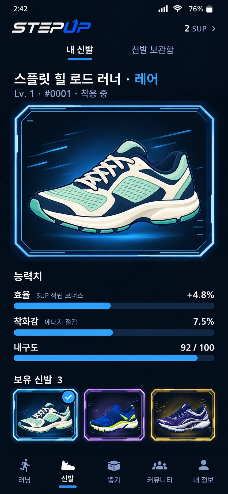
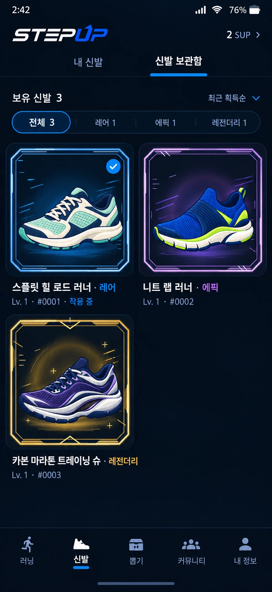
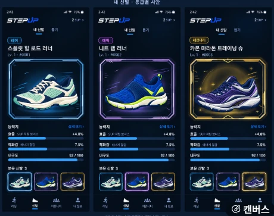

# 신발 화면 확정안 — 내 신발 · 신발 보관함 · 등급 배지 여섯 (2026-09-28)

사용자 전달본(`CLAUDE-HANDOFF.md`, 확정 시안 두 장 `references/01` · `02`, 둥근 배지 참고 `references/03`, 배지 여섯 `badges/01`–`06`,
생성 기록 `PROMPTS.md`)을 앱에 옮겼다. 그림은 용량 때문에 WebP 로 바꿔 두었다(내용 그대로). 목업 PNG 를 앱 화면으로 쓰지 않는다 —
화면은 Compose 로 그리고 신발 · 프레임은 기존 그림을 쓴다.

| 확정 시안 01 내 신발 | 확정 시안 02 신발 보관함 | 둥근 배지 참고(모양만) |
|---|---|---|
|  |  |  |

## 내비게이션 — 하단 다섯, 뽑기는 가운데 독립 탭

- 하단: **러닝 / 신발 / 뽑기 / 커뮤니티 / 내 정보**(`AppChromePolicy.tabs`). 2026-09-26의 "탭 넷 · 뽑기는 신발 안"을 대신한다.
- 뽑기 탭은 기존 신발 뽑기 v2(`Routes.MYSTERY_BOX`, 길 이름 그대로)를 연다 — `Screen.Draw`, 머리는 공통(`Header.Main`: 로고 · 실제 잔액),
  두 칸 위에 제목 "신발 뽑기"(뒤로 버튼 없음). 요청 · 상자 열기 · 결과 · 확인 동안은 v2 시안처럼 화면을 다 쓴다 —
  루트 셸이 `AppChromePolicy.immersive` 를 보고 공통 머리 · 하단 탭을 걷는다(뽑기 탭에서만).
- 알림 · 지갑 · 공지 · 보관함 · 빈 신발 목록의 "신발 뽑기"는 모두 뽑기 탭으로 옮겨 간다(`switchTab(Screen.Draw)` — 뒤로 쌓이지 않는다).
  뽑기 결과의 "내 신발 보기"는 신발 탭(내 신발)으로 가서 받은 신발을 고른 채로 연다(착용은 그대로).
- 신발 탭 위 글자 탭: **내 신발 · 신발 보관함**(`S2ShoesSections`, `ShoeSection`). 신발 위에 뽑기를 남기지 않았다.
- 새 아이콘: 뚜껑 덮인 상자(`StepUpIcons.DrawBox`).

## 내 신발 — 세로로 끌지 않고 다 보이게

위에서부터 이름 + 끝의 작은 둥근 등급 배지 → `Lv. 1 · #0001 · 착용 중`(착용 중은 실제로 신고 있는 켤레에만) → 등급 프레임 속 실제 신발
(무대 면 → 뒤 효과 → 신발 → 앞 효과 → 프레임, 440:418 그대로) → 능력치 막대 셋 → 보유 신발 가로 목록.

- **높이**: 글자 칸(이름 · 능력치 · 보유)을 먼저 재고 무대는 남은 높이만큼(`MyShoesLayout`). 창 안에 다 들면 세로 스크롤 거리가 0 이다.
  짧은 창(내 신발 칸이 560dp 아래 — 작은 폰 · 3버튼 내비 · 큰 글씨)은 무대가 줄기 전에 여백 · 보유 칸 · 이름 글자를 줄이고,
  무대가 116dp 아래로 내려가야 할 때만 스크롤에 맡긴다(큰 글씨에서 글자가 잘리지 않게). 능력치 · 보유 목록을 하단 탭 뒤로 밀지 않는다.
- **보유 목록**: 켤레마다 한 칸(같은 모델도 소유 id 로 따로) — 신고 있는 켤레 먼저, 그다음 최근에 받은 순. 칸은 작은 프레임(효과 없이 신발을
  알아보게). 누르면 보는 신발만 바뀐다(무대 · 이름 · 능력치). 고른 칸은 바깥 테두리, 신고 있는 켤레는 작은 파란 체크 — 서로 다른 표시.
  예전 "N켤레 보기" 시트는 칸이 켤레마다라 필요 없어져 없앴다.
- **상세 보기 글 링크 없음.** 이 켤레의 기존 관리(이 신발 신기 · 강화 · 수리 · 판매 — 신발 상세 화면)는 이름 오른쪽 작은 관리(⋯)나
  무대를 눌러 연다. 큰 상세 버튼 · 원형 착용 영역을 두지 않았고, 고르기만으로 착용이 바뀌지 않는다.
- 읽는 중(이름 자리 · 빈 무대) · 실패(다시 불러오기) · 정말 빈 목록(신발 뽑기 → 뽑기 탭)을 가른다 — 예시 신발 · 임시 값을 보이지 않는다.

## 능력치 — 실제 값, 모든 신발에 같은 막대 기준

| 줄 | 짧은 설명 | 값(기존 상세와 같은 출처) | 막대 끝 | 근거 |
|---|---|---|---|---|
| 효율 | SUP 적립 보너스 | `bonusPercent` — 서버 신발 `efficiencyBps ÷ 100`, 예전 신발 도감 값 + 레벨당 0.5 | 27.5% | 레전더리 최고 효율 1,300bps + 레벨당 50bps × (최고 30레벨 − 1) = 2,750bps (`economy.efficiency_range` · `efficiency_per_level_bps` · `max_level`, 0022) |
| 착화감 | 에너지 절감 | `energySavingPercent` — (1 − `energyEfficiency`) × 100 | 20% | `economy.comfort_cap_bps()` = 2,000bps (0022). 예전 신발은 최대 15% |
| 내구도 | — | `durabilityPoints` — 서버 값은 내려서(99.6 → 99) | 100 | 내구도 0~100 |

- 막대 길이 = 실제 값 ÷ 막대 끝(0~1로 자름). 4.8% 를 48% 길이로 늘이지 않는다. 세 막대는 같은 트랙 폭 · 두께 · 정렬, 색은 등급과 상관없이 같은 파랑
  (레드라인의 붉은색이 "내구도 위험"처럼 읽히지 않게).
- 능력치 덩어리를 누르면 "막대 기준" 시트 — 모든 신발에 같은 기준이라는 것과 막대 끝 값, "효율은 보너스 비율이지 금액이 아니고, 실제로 받는
  SUP 는 러닝 뒤 서버가 확인한다"를 적는다. 읽기 도구는 줄마다 "효율(SUP 적립 보너스) +4.8%. 막대 끝 27.5%"처럼 읽는다.
- 서버 신발에 없는 행운은 만들지 않는다(예전 신발의 행운 · 착화감 원시값은 기존 상세의 "능력치 자세히"에 그대로).
- 시안의 +4.8% · 7.5% · 92 / 100 · 잔액 · 수량 · 레벨은 예시다 — 앱은 늘 실제 신발 값을 쓴다.

## 신발 보관함 — 2열 격자

- 위(고정): `보유 신발 N`(실제 켤레 수) · 정렬(최근 획득순 — 기본 · 등급 높은순 · 레벨 높은순, 기존 정렬 시트) · 거르기(전체 + 가진 갈래만,
  칸마다 실제 수 — 좁으면 한 줄로 가로 이동, 여러 줄로 쌓지 않는다). 아래: 2열 격자(세로로 넘긴다).
- 칸: 등급 프레임 속 실제 신발(효과 포함, 좁은 칸은 1배 그림) → 이름 끝 둥근 배지 → `Lv · # · 착용 중`. 착용 체크는 실제로 신고 있는 한 켤레에만,
  고른 켤레(내 신발에서 보는 켤레와 같다)는 칸 테두리로 따로. 칸을 누르면 그 켤레를 고르고 관리(신발 상세)로 간다.
- 등급 높은순은 서버 등급(넷)으로 매기고 같은 등급 안에서는 레전더리 · 레드라인 · 피니시끼리 모은다 — 레드라인 · 피니시를 더 높은 등급처럼 매기지 않는다.
- 보유하지 않은 신발 · 상품 · 빈 칸 채우기를 넣지 않는다. 도감 · 마켓 · 아이템(스토어 · NFT 마켓 · 발행)은 격자 아래 작은 줄로 따로 들어간다.

## 둥근 등급 배지 여섯

| 배지 | 갈래 | 재현한 특징(작은 크기에서도 남긴다) |
|---|---|---|
|  | 일반 | 브러시드 실버 테두리, 번짐 없음, 양 끝 짧은 각인 |
|  | 레어 | 블루 · 아이스 테두리와 번짐, 왼쪽 비스듬한 속도선 둘, 오른쪽 가속 눈금 셋 |
|  | 에픽 | 퍼플 · 라벤더, 양 끝 프리즘 면, 오른쪽 아래 빗금 |
|  | 레전더리 | 골드 · 샴페인 금속광, 위 테두리 가운데 꺾쇠, 오른쪽 작은 광점 |
|  | 레드라인 | 코럴 → 앰버, 왼쪽 가속선, 오른쪽 곡선 열기 파동 둘 |
|  | 피니시 | 민트 · 보라 · 아이스화이트, 안쪽 궤도선, 오른쪽 체커 결승 테이프(2 × 4) |

- 전달 PNG(2172 × 724, 한국어 글자가 든 원본)는 디자인 기준으로 두고, 앱은 캡슐 · 이중 테두리 · 갈래 장식을 그리고 글자는 기기 글꼴로 얹는다
  (`ShoeGradeBadge`) — 글자 확대 · 다국어(일반/Common/コモン/普通 …)가 그대로 된다. 3:1 캔버스를 짧은 글자에 억지로 쓰지 않고 글자 길이에 맞춘다.
- 크기: 보이는 높이 24dp(글자가 커지면 같이 커진다), 글자 11.5sp, 양옆 11dp(장식 자리), 이름과 6dp. 정적 — 애니메이션 없음.
- 자리: 이름의 **마지막 줄 끝, 같은 줄**(`ShoeNameWithBadge` — 글 안의 자리 표시). 이름이 두 줄을 넘으면 이름을 줄여 "…"를 붙이고 배지는 남긴다.
  배지 때문에 따로 한 줄이 생기지 않는다. 누르는 곳이 아니다(읽기 도구는 이름 글과 함께 "… 레어"로 한 번만 읽는다).
- 내 신발 · 보관함이 같은 배지를 쓴다.

## 여섯 갈래와 실제 데이터

- `ShoeTier`(보이는 갈래 여섯)는 알려진 시리즈 REDLINE · FINISH 를 먼저, 나머지는 실제 `Rarity` 로 고른다(`Sneaker.tier`). `ShoeTier.rarity` 는 늘
  서버 등급 넷 중 하나다. 서버 등급 · 드롭률 · 보상 · NFT · DB 는 바꾸지 않았다.
- 큰 프레임 · 작은 칸 · 배지 · 거르기가 모두 같은 갈래를 따른다. 레드라인 · 피니시 레이어(05 · 06)는 `tools/build_shoe_grade_frames.py` 로 만들었다
  (기존 네 등급 2배 레이어는 바이트 그대로). 좁은 자리용 1배 뒤 · 앞 효과를 더해 레이어는 34장이다 — 격자 칸마다 2배 그림을 풀지 않는다.
- 이 앱에 그림이 없는 새 모델 번호면 프레임 안에 다른 신발 대신 빈 그림 표시만 둔다(보유 신발 상세 v1 시안 16과 같은 규칙).

## 확인

- 단위: `MyShoesModelTest`(갈래 고르기 · 막대 끝과 길이 · 보유 목록 순서 · 보는 켤레 · 보관함 정렬 · 거르기 수) · `AppChromePolicyTest`(탭 다섯 · 뽑기 탭 ·
  흐름 동안 셸 걷기) · `ShoeGradeArtTest`(여섯 갈래 레이어) · `ShoeDetailModelTest`.
- 기기(Experience QA `community` 묶음):
  - `MyShoesDesignTest` → `screen-gallery/my-shoes/` — 앱 셸 그대로 360×800 · 390×844 · 412×915(dp) 화면을 에뮬레이터 창 안에 만들고(창 높이를 그 dp 로 채우는
    밀도), 내 신발의 세로 스크롤 거리 0 · 이름 · 무대 · 능력치 · 보유 목록이 하단 탭 위에 온전히 · 무대 440:418 을 잰다. 여섯 갈래 무대 · 배지, 막대 기준 시트,
    관리(⋯ → 상세, 착용 그대로), 보관함(실제 수 · 2열 · 체크 한 켤레 · 거르기 · 정렬), 큰 글씨 1.3 · 밝은 테마 + 읽는 중 · 실패 · 빈 목록 · 긴 이름 · 배지 장면.
  - `ShoeDetailDesignTest` · `ShoeGradeFrameTest` · `ShoeCatalogDesignTest` · `ShoeDrawTest` · `ShoeDrawV2DesignTest` · `ExperienceUiTest` · `ChromeNavigationTest` ·
    `DesignReferenceTest` 를 새 구조(탭 다섯 · 뽑기 탭 · 내 신발/보관함)에 맞췄다.
- 정적: `tools/check_design_contract.py` · `scripts/check-strings.py` · `tools/check_experience_assets.py` · `tools/ui_inventory.py`.
